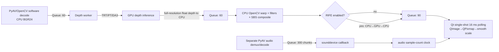
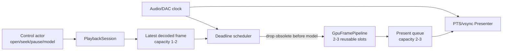

# `sbs_player.py` GPU, AI, and Playback Performance Review

Reviewed revision: `68722c7` (`master`)

## Executive summary

`Nightfall Player` has the right broad pipeline—decode, depth inference, stereo synthesis, optional interpolation, and presentation—but the current implementation is not yet a safe low-latency GPU video pipeline. The largest obstacles to “buttery smooth” playback are architectural, not isolated Python micro-optimizations:

1. **TensorRT is given raw pointers to buffers whose dtype/size is not derived from the engine.** The local ONNX export starts with FP32 I/O, while the application always allocates FP16 TensorRT I/O. This can produce incorrect results or out-of-bounds GPU memory access.
2. **Video queues retain seconds of stale work and can hold gigabytes of image data.** Frames are generally dropped only after inference and warp, when the expensive work has already been paid.
3. **Worker lifetimes are not owned.** Video/model changes briefly toggle one shared Boolean, sleep, and start more daemon threads without joining the old ones. Old and new workers can overlap and use replaced CUDA/TensorRT resources.
4. **The fast path is not GPU-resident.** It decodes into CPU BGR, uploads to infer depth, downloads a full-resolution float depth map, performs the expensive warp and filters on CPU, optionally uploads/downloads again for RIFE, then copies/scales again for Qt.
5. **Presentation is a fixed 16 ms poll, not a PTS/deadline/vsync-driven presenter.** Callback cost accumulates into cadence drift, and 23.976/29.97/59.94 fps do not map cleanly to this timer.
6. **Configuration can select a backend after a different backend has already been loaded.** This can crash a worker and also makes `--no-trt` unreliable.

The highest-value sequence is therefore:

- make TensorRT contracts and worker lifecycle correct;
- replace deep FIFOs with deadline-aware, tiny buffers and pre-inference dropping;
- establish trustworthy profiling and presentation metrics;
- reduce CPU/GPU transfers incrementally;
- then move warp/composite/presentation to the GPU and optionally add NVDEC.

Do **not** start with batching, INT8, CUDA Graphs, or more threads. Those can improve throughput while making interactive latency and frame age worse. Playback should remain batch 1, with a strict latency budget.

---

## Scope, evidence, and limitations

Reviewed:

- `sbs_player.py` (2,194 lines)
- `README.md`
- `PLAN.md`
- `install.sh`

Validation performed locally:

- `sbs_player.py` parses and compiles with Python's `compile()`.
- Static control/data-flow, queue, thread, CUDA, TensorRT, PyAV, sounddevice, and Qt paths were inspected.
- Queue memory bounds were calculated from actual capacities and array formats.
- Current PyTorch, Hugging Face Transformers, and NVIDIA TensorRT guidance was consulted; sources are listed at the end.

Validation **not** performed:

- The local `.venv/` is intentionally empty.
- The review host has AMD graphics, not the NVIDIA/CUDA/TensorRT stack targeted by the application.
- No model was downloaded; no inference, TensorRT build, PyAV playback, audio output, Qt rendering, CUDA profiling, or visual-quality comparison was run.

Findings marked as code defects are visible directly in the source. The magnitude of individual bottlenecks, exact CUDA stream behavior under the eventual package versions, model quality, and frame-cadence behavior must still be measured on an NVIDIA target.

### What these “AI models” are doing

The main models are monocular depth estimators, not frame-generative video models. Depth Anything V2/DA3 estimates one relative-depth field per source frame. That field drives a deterministic horizontal warp to synthesize the right eye. RIFE is the generative/interpolation component: it creates midpoint frames when frame doubling is enabled.

This distinction matters for optimization:

- depth inference should normally remain batch 1;
- temporal stability and normalization are as important as single-frame depth quality;
- RIFE is optional work and must yield to source-frame deadlines;
- a smaller depth model or fewer depth inferences with motion-aware propagation may look smoother than a larger model that misses deadlines.

---

## Current architecture and data flow



Relevant code:

- construction, backend selection, and queue creation: `sbs_player.py:87-133`
- PyAV/OpenCV decode: `sbs_player.py:509-656`
- TRT/PyTorch/DA3 inference: `sbs_player.py:658-820`
- stereo warp and RIFE: `sbs_player.py:822-956`
- audio callback/decode: `sbs_player.py:958-1058`
- worker creation: `sbs_player.py:1088-1110`
- Qt presentation: `sbs_player.py:1713-1858`
- seek/video/model transitions: `sbs_player.py:1970-2075`

### Existing good choices

The code already has several useful foundations:

- fixed batch-1 TensorRT profiles (`sbs_player.py:379-384`);
- persistent TensorRT input/output tensors (`sbs_player.py:399-406`);
- `torch.inference_mode()` on PyTorch/DA3 inference (`sbs_player.py:752-754`, `792-799`);
- GPU-side EMA on the TRT/PyTorch depth output (`sbs_player.py:701-708`, `756-761`);
- separate decode, inference, warp, and audio threads (`sbs_player.py:1092-1099`);
- generation/epoch tags to reject some stale seek output;
- cached remap coordinate grids (`sbs_player.py:904-909`);
- a reduced 256×256 Sobel path for the normal artifact mask (`sbs_player.py:927-937`).

These are worth preserving inside a safer session and scheduling design.

---

## Prioritized findings

| ID | Severity | Finding | Primary consequence |
|---|---|---|---|
| F-01 | Critical | TensorRT I/O buffers ignore engine dtype/shape | Wrong results, illegal memory access, invalid precision benchmarks |
| F-02 | Critical | Workers are not stopped/joined transactionally | Duplicate pipelines/audio, CUDA races, leaks, switch-time stutter |
| F-03 | Critical | Persisted config changes backend after loading | Deterministic missing-attribute crashes; `--no-trt` can be ignored |
| F-04 | Critical | Multi-second FIFO queues and late dropping | 1.68 GiB at 1080p / 6.72 GiB at 4K, stale frames, high latency |
| F-05 | High | Preprocess and TensorRT streams lack an explicit dependency | Possible stale input and misleading timings |
| F-06 | High | Model/video/RIFE operations block the Qt event loop | 0.5-second to multi-minute UI freezes |
| F-07 | High | Full-resolution CPU↔GPU ping-pong and CPU warp/render | Large transfers, synchronization, CPU bandwidth, poor 4K scaling |
| F-08 | High | Fixed 16 ms polling without a presentation contract | Cadence jitter, timer drift, no reliable 59.94/60 Hz delivery |
| F-09 | High | EOF is signaled before the processed tail is presented | End of clips can be truncated |
| F-10 | High | Seek and audio timing are not PTS-accurate end to end | Wasted post-seek inference, flashes, A/V error |
| F-11 | High | RIFE reuploads two full frames and always emits exactly one midpoint | Extra synchronization and incorrect “60 fps” semantics |
| F-12 | Medium/High | Model/input policy optimizes neither deadline nor temporal quality | Large default misses budgets; square distortion; depth pumping |
| F-13 | Medium | Per-frame telemetry, pixmap scaling, and slider disk writes run on GUI thread | Avoidable interaction and presentation jitter |
| F-14 | Medium | Busy polling, blocking puts, swallowed failures, weak metrics | CPU wakeups, shutdown hangs, silent stalls, bad optimization data |

---

## Detailed findings and recommended fixes

### F-01 — TensorRT I/O must be derived from the engine contract

**Evidence**

- The fallback ONNX export uses a default FP32 model and FP32 dummy input (`sbs_player.py:322-332`).
- `BuilderFlag.FP16` is optional and only permits lower-precision tactics (`sbs_player.py:370-377`); TensorRT engine I/O commonly remains FP32 unless explicitly changed.
- Both depth I/O tensors are always allocated as `torch.float16` (`sbs_player.py:402-403`) and their raw addresses are bound directly (`sbs_player.py:405-406`).
- RIFE makes the same unconditional FP16 assumptions (`sbs_player.py:452-486`).
- The depth cache filename always ends in `_fp16.engine`, including FP32 or INT8 requests (`sbs_player.py:351-377`).
- Engine deserialization, context creation, tensor metadata, and `execute_async_v3()` results are not robustly validated (`sbs_player.py:352-399`, `696-698`).

TensorRT receives an address, not a PyTorch tensor contract. If an engine expects FP32 but is given a half-sized FP16 allocation, it can read/write the wrong number of bytes. This is a correctness and memory-safety gate, not merely an optimization.

The CLI's `int8` wording is also misleading. The TensorRT builder has no calibrated or Q/DQ INT8 path. `load_in_8bit=True` exists only in the PyTorch loader (`sbs_player.py:303-309`), but V2 defaults to TensorRT.

**Required redesign**

1. Enumerate engine tensors after build/deserialization.
2. Assert expected names and input/output modes.
3. Read `get_tensor_dtype`, `get_tensor_shape`, tensor location, and format.
4. Allocate the exact dtype, shape, and byte size reported by the engine.
5. Validate address binding and execution return status.
6. Compare TRT output against PyTorch/ONNX on fixed frames.
7. Apply the identical discipline to RIFE.

Cache identity should include at least:

- model/ONNX content hash and revision;
- input shape/aspect profile;
- actual I/O dtype and enabled compute precision;
- calibration/Q-DQ identity for INT8;
- TensorRT version and relevant builder flags;
- GPU compute capability/hardware-compatibility policy;
- application cache-schema version.

Write engine + manifest transactionally and rebuild on mismatch, corrupt data, or failed deserialization.

**NVIDIA acceptance test**

- dump every engine tensor contract;
- run under Compute Sanitizer;
- compare fixed-frame outputs to the source model within precision-specific tolerances;
- build/load FP16 and FP32 variants without cache collision;
- prove a stale/corrupt/incompatible cache causes a deterministic rebuild.

### F-02 — Give every playback generation an owned lifecycle

**Evidence**

- Worker handles are local variables and are never retained or joined (`sbs_player.py:1092-1109`).
- `stop()` only changes `running` and closes the currently referenced audio stream (`sbs_player.py:1245-1252`).
- Producers can block indefinitely in `put()` (`sbs_player.py:592`, `654`, `721`, `773`, `820`, `883-891`, `1049`).
- Consumers use the racy `empty()` then blocking `get()` pattern while another thread can flush the queue (`sbs_player.py:498-507`, `668-676`, `823-833`).
- Video/model changes set `running=False`, sleep 0.5 seconds, mutate shared state, set the same Boolean to true, then create new threads (`sbs_player.py:1997-2075`).

An old worker blocked in decode, CUDA synchronization, or queue I/O can miss the brief false interval. It may resume after shared TensorRT contexts, stream handles, model objects, video path, or queues have been replaced.

**Required redesign**

Create one deep `PlaybackSession` abstraction that owns:

- immutable media path, model/backend bundle, and generation ID;
- cancellation `Event`;
- all worker handles;
- all stage buffers/queues;
- PyAV containers and audio stream;
- one `close()`/`stop_and_join()` operation.

Use `get(timeout=...)`, `put(timeout=...)`, or explicit sentinels so cancellation can unblock every stage. Resource cleanup belongs in `finally`. Never set a cancellation flag back to false for a new generation; create a new session and publish it only after the old one has joined and the replacement is ready.

**Acceptance test**

With fake slow/full workers, switch files/models 100 times and assert:

- thread count returns to baseline;
- all generations join;
- no stale generation performs work after replacement;
- file descriptors, audio streams, RSS, and VRAM stabilize.

### F-03 — Resolve configuration before loading any backend

**Evidence**

- Constructor arguments cause a backend to load at `sbs_player.py:119-128`.
- Persisted JSON is loaded only later (`sbs_player.py:222-266`).
- That JSON changes `model_name`, `use_trt`, and `is_da3` without loading matching resources.
- `depth_inference_thread()` dispatches entirely from these late flags (`sbs_player.py:658-664`).
- Any saved V2 model sets `use_trt=True` (`sbs_player.py:265`), which can override `--no-trt` supplied at `sbs_player.py:2175`.

A saved DA3 choice after default V2 construction can dispatch to `_depth_loop_da3` without `da3_model`. A saved V2 variant can show one model name while using a different engine. A `--no-trt` run can dispatch to TRT fields that were never created.

**Required redesign**

Use one validated immutable `AppConfig` with documented precedence. A sensible policy is:

```text
defaults < persisted preferences < explicit CLI flags
```

Separate these concepts instead of overloading `use_trt`:

- requested backend policy;
- model family capabilities;
- detected machine capabilities;
- selected runtime backend;
- active backend ID used for telemetry.

Load exactly one backend from that resolved specification. On model changes, build a replacement asynchronously and swap it transactionally.

### F-04 — Replace storage-sized queues with a latency budget

Actual capacities are hard-coded at `sbs_player.py:130-133`; constructor `buffer_size` is stored but unused (`sbs_player.py:87-91`).

Theoretical queued video payload:

| Resolution | `frame_queue` | `depth_queue` | `sbs_queue` | Total payload bound |
|---|---:|---:|---:|---:|
| 720p | 0.15 GiB | 0.36 GiB | 0.23 GiB | **0.75 GiB** |
| 1080p | 0.35 GiB | 0.81 GiB | 0.52 GiB | **1.68 GiB** |
| 1440p | 0.62 GiB | 1.44 GiB | 0.93 GiB | **2.99 GiB** |
| 4K | 1.39 GiB | 3.24 GiB | 2.09 GiB | **6.72 GiB** |

This excludes active frames, OpenCV temporaries, QPixmaps, audio, Python overhead, PyAV objects, and GPU allocations. At 30 fps, the input/depth capacities each represent two seconds and the SBS queue represents three seconds.

The GUI drops late frames at `sbs_player.py:1732-1797`, after depth inference, warp, and possibly RIFE. In addition, queue residence is folded into `pipeline_latency` (`sbs_player.py:846-847`), then the growing value widens accepted A/V lag (`sbs_player.py:1751-1753`). Backlog can therefore legitimize more backlog.

**Required redesign**

- decoded latest-frame mailbox: capacity 1–2;
- active GPU slots: 2–3 reusable slots, not an arbitrary FIFO;
- presentation queue: capacity 2–3, containing one due and one/few future frames;
- audio: a duration-based target such as 100–500 ms, tuned to device stability;
- fixed presentation-latency target and fixed late threshold;
- drop before inference when a source frame cannot meet its deadline;
- track queue age and drop reason separately from sync policy.

Under overload, keep the newest useful frame, not every historical frame. If frames are skipped, make temporal smoothing aware of elapsed media time or reset it after a sufficiently large gap.

### F-05 — Establish explicit CUDA stream ordering and honest timing

**Evidence**

- H2D, conversion, flip, resize, copy, and normalization are issued on the worker's current/default stream (`sbs_player.py:683-691`).
- TensorRT is issued immediately on a separate `trt_stream` (`sbs_player.py:695-698`) with no `wait_stream` or CUDA event.
- Synchronizing `trt_stream` afterward waits for that stream but does not itself establish the missing producer dependency.
- `last_preprocess_ms` measures CPU enqueue time, not completed GPU work (`sbs_player.py:681-693`).
- `if diff > 0` converts a GPU scalar to a Python Boolean and forces synchronization (`sbs_player.py:710-717`).

**Simplest safe fix**

Run upload/preprocess, TensorRT, and dependent GPU postprocess in one explicit stream. If copy and compute streams are later split, connect them with recorded CUDA events and use double-buffered slots. Keep persistent buffers alive for the stream that uses them.

Use CUDA events for GPU stage timing and `monotonic_ns()`/`perf_counter_ns()` for CPU and end-to-end timing. Synchronize only when CPU ownership is truly required, not merely to read a timer.

CUDA Graph capture is plausible because shapes and addresses can be stable, but only after the stream, buffer, and lifecycle contracts are correct. Use it only if Nsight shows launch/enqueue gaps are material.

### F-06 — Move model/session state transitions off the GUI thread

Normal UI actions can block for long periods:

- initial `start_threads()` runs before normal GUI timer setup and can prime for ten seconds (`sbs_player.py:1288-1296`, `1088-1109`);
- enabling RIFE can download and build the engine synchronously from a checkbox handler (`sbs_player.py:410-488`, `1964-1968`);
- opening video sleeps, probes, may rebuild RIFE, and primes synchronously (`sbs_player.py:1997-2055`);
- changing model sleeps and may download/export/build synchronously (`sbs_player.py:2057-2075`, `318-397`).

Use one background transition coordinator for session stop/join, media probe, download, model/engine build/load, and warm-up. Report progress/errors to Qt through queued signals. Keep the old session active until a replacement is ready when feasible, then swap atomically. Disable only controls that conflict with the pending transition.

A Qt heartbeat timer should continue with a bounded p99 delay while an injected model loader sleeps for several seconds.

### F-07 — Remove representation churn; first incrementally, then strategically

The fast path currently performs:

1. PyAV decode to pageable CPU BGR (`sbs_player.py:581-592`).
2. Full source-frame H2D before shrinking to 518×518 (`sbs_player.py:683-690`).
3. Full-resolution GPU depth expansion and float32 D2H (`sbs_player.py:710-717`).
4. CPU blur/remap/Sobel/mask/box-filter/sharpen/resize/hstack (`sbs_player.py:838-954`).
5. Optional full SBS reuploads/download for RIFE (`sbs_player.py:849-887`).
6. QImage→QPixmap conversion and smooth scaling (`sbs_player.py:1845-1853`).

For 4K, the base TRT path moves roughly 23.7 MiB of BGR H2D plus 31.6 MiB of float depth D2H per source frame before display upload. At 30 fps that is about 1.6 GiB/s of payload, excluding RIFE and temporary allocations. Bandwidth alone may be acceptable on PCIe, but the forced ownership changes and synchronization points are poor for latency variance.

#### Design A — incremental, lower risk

Keep CPU decode and CPU warp temporarily, but:

- resize/convert to model resolution before H2D;
- use a reusable pinned host ring rather than calling `pin_memory()` on each frame;
- use persistent device intermediates;
- transfer model-resolution depth back and resize it on the CPU, where warp already lives;
- cache/reuse CPU destination arrays where OpenCV permits;
- avoid smooth GUI scaling when source/widget geometry is unchanged.

At 4K, transferring a 518-class depth map rather than a full-resolution float map reduces that D2H payload from about 31.6 MiB to roughly 0.5–1 MiB, depending on dtype/shape. This design is useful as a benchmarkable intermediate step.

#### Design B — strategic GPU-resident path (recommended target)

Use a small ring of GPU frame surfaces:

```text
NVDEC/CPU pinned upload
  → fused color/resize/normalize
  → TensorRT depth
  → temporal scale + depth upsample
  → disparity/warp/filter/composite
  → optional interpolation
  → persistent OpenGL/Vulkan texture
  → vsynced presentation
```

Only metadata should routinely cross to the CPU. Hide CUDA/OpenGL/Vulkan ownership and events behind one `GpuFramePipeline` interface. Do not expose raw tensors or backend-specific temporal state to the GUI.

The installed `opencv-python` wheel should not be assumed to include `cv2.cuda`; use CUDA kernels, NPP, torch operations such as `grid_sample` where appropriate, a CUDA-enabled OpenCV build, or another explicit GPU implementation. Profile quality and performance before selecting the primitive.

### F-08 — Presentation must be PTS/deadline/vsync driven

The Qt loop uses a single-shot 16 ms timer and restarts it only after callback work (`sbs_player.py:1292-1296`, `1858`). The callback also drains queues, queries CUDA/NVML, updates widgets, creates a QPixmap, and scales it. Callback duration is added to the next interval. Due/late decisions are quantized to those callbacks (`sbs_player.py:1751-1800`).

This is unsuitable for film rates, 29.97/59.94, high-refresh displays, and reliable RIFE presentation.

**Required presenter behavior**

- map source PTS to an absolute monotonic playback epoch;
- use the audio DAC clock as master when present;
- schedule every wake from the absolute deadline, not “16 ms after callback completion”;
- request `Qt.PreciseTimer` for coarse wake-up;
- keep one future frame and present the newest due frame;
- use an OpenGL/Qt Quick/Vulkan presentation path with explicit swap/vsync behavior;
- record scheduled wake, actual wake, submission, and—if available—actual presentation feedback.

No-audio playback also needs this clock. It currently breaks out of A/V gating and largely relies on decode pacing (`sbs_player.py:1747-1748`).

### F-09 — Propagate EOF through the pipeline

The reader sets `video_ended=True` as soon as demux/decode reaches EOF (`sbs_player.py:565-576`, `642-650`). At that moment, inference/depth/SBS queues can still contain the unprocessed tail. `update_frame()` reacts before consuming another SBS frame and seeks to zero or switches playlist (`sbs_player.py:1713-1727`), after which queues are flushed.

Send an EOF marker through decode → inference → warp → presentation. Only transition playlist/loop state after the final frame has been presented and the matching audio tail has drained.

A 30-frame synthetic clip with deliberately slow fake inference should present all 30 PTS values exactly once before EOF.

### F-10 — Make seek and audio timing generation/PTS accurate

PyAV seek is backward to a keyframe (`sbs_player.py:535-546`), but every decoded pre-target frame is enqueued (`sbs_player.py:581-592`). These frames are inferred and warped before some are dropped in the GUI. Audio similarly seeks, resets its sample counter to the requested target, and emits decoded samples without trimming by audio-frame PTS (`sbs_player.py:1017-1049`).

The GUI also flushes before the reader increments `seek_epoch`, leaving a window where an in-flight old frame can still carry the currently accepted epoch (`sbs_player.py:1973-1986`, `535-546`).

Represent seek as one generation-stamped command owned by the session:

- advance generation before any queue mutation;
- backward-seek decoder state;
- decode video pre-roll but discard it before inference until target PTS;
- flush resampler/decoder state;
- trim the first audio frame to target using PTS/time base;
- anchor audio clock to first emitted PTS and DAC timing;
- publish only new-generation output.

The sound callback currently performs Python queue operations and NumPy slicing (`sbs_player.py:958-980`). Keep callback work allocation-free where possible, use a callback-safe ring, and record underrun status. Decide explicitly whether clock time advances during underrun rather than letting queue starvation define presentation semantics accidentally.

### F-11 — Treat RIFE as budgeted optional work

The current RIFE path uploads both previous and current CPU SBS images for each midpoint, converts/pads/copies, executes, hard-synchronizes, downloads output, and copies the current CPU frame (`sbs_player.py:849-887`). It can contend with the next depth inference without deadline-aware arbitration.

It also does not intrinsically target 60 Hz; it emits exactly one midpoint. Therefore:

- 23.976 → 47.952 fps;
- 25 → 50 fps;
- 29.97 → 59.94 fps;
- 60 → 120 fps.

Keep previous/current frames in reusable GPU slots and upload each new source frame once. Derive interpolation count and timestamps from source PTS and actual display refresh. If source depth or presentation is near deadline, skip interpolation. Compare serial, concurrent, and stream-priority designs using p99 source-frame latency, not average GPU utilization.

Also inspect visual artifacts at the SBS seam. A convolutional interpolator sees the two eye images as one adjacent image; separating/padding eyes or interpolating before SBS composition may produce better edge behavior.

### F-12 — Adapt model cost and stabilize depth semantics

#### Default model

The default is V2 Large at 518 (`sbs_player.py:2150-2156`). The installer itself describes Small as fastest and Base as balanced. Defaulting to the largest model is a quality-first policy that may be incompatible with smoothness across unknown GPUs.

Benchmark Small/Base/Large and select the highest-quality profile with sustained headroom. A practical automatic policy should use hysteresis and adjust only after repeated deadline pressure.

#### Input geometry

The TRT path stretches every frame to 518×518 (`sbs_player.py:684-690`). The PyTorch path attempts aspect preservation and patch-size rounding (`sbs_player.py:738-747`) before passing through an image processor that may resize again (`sbs_player.py:749`). Stretching can damage depth geometry and wastes model pixels for wide video. Evaluate aspect-preserving, multiple-of-14 profiles with explicit pad/crop metadata. Prebuild a small set of common fixed profiles if dynamic shapes harm TensorRT optimization.

#### Temporal normalization

Depth EMA is followed by independent per-frame min/max normalization (`sbs_player.py:701-715`, `756-768`, `803-815`). A single changing extremum rescales the whole depth field and can reintroduce disparity “pumping” even when local depth is smoothed.

Use a robust range (for example clipped percentiles or another outlier-resistant estimator) and filter that range over media time. Add scene-cut detection and reset depth/range state on cuts, seeks, model changes, and large dropped-frame gaps. Motion-compensated depth propagation can later improve temporal alignment, but basic range stability and cut reset are cheaper first wins.

#### Other model techniques

- **Batching:** keep batch 1 for interactive playback. Use batches only in a separate offline-conversion mode.
- **FP16:** appropriate NVIDIA baseline after validating I/O separately from internal tactic precision.
- **INT8:** only after a real calibrated/Q-DQ TensorRT implementation and stereo-quality study.
- **PyTorch fallback:** benchmark `torch.compile(mode="reduce-overhead")`, autocast, channels-last where supported, and fixed-shape graphs. Do not assume they beat TensorRT.
- **Inference every Nth frame:** high-value for 60 Hz when paired with motion-aware depth propagation/confidence masks. It reduces the learned model's call rate directly.
- **CUDA Graphs:** evaluate only if fixed-shape launch overhead is material in Nsight.

### F-13 — Remove incidental GUI-thread jitter

- CUDA utilization, NVML memory, stats text, and layout updates happen every displayed frame (`sbs_player.py:1820-1843`). Poll telemetry at 2–4 Hz on a separate timer and display cached values.
- Every slider `valueChanged` writes and prints the JSON config synchronously (`sbs_player.py:1694-1708`, `271-295`). Debounce 250–500 ms, save on slider release/close, and use temp-file + `os.replace`.
- Every frame constructs a QImage/QPixmap and calls `Qt.SmoothTransformation` (`sbs_player.py:1845-1853`). Use a persistent texture renderer.
- `fps_history` rebuilds a list each frame (`sbs_player.py:1811-1813`). A deque is a small cleanup, but only after the larger GUI costs.

### F-14 — Replace polling/masking with cancellation and structured telemetry

- `empty()/full()` plus 1/10/50 ms sleeps add wakeups and jitter (`sbs_player.py:548-554`, `625-631`, `668-669`, `824-825`). Use blocking operations with timeout/cancellation.
- Decode/audio exceptions are frequently swallowed (`sbs_player.py:577-598`, `1033-1051`). Inference/warp workers have no reliable fatal-error channel. A worker can die while the UI keeps polling an empty queue.
- `sys.exit()` appears inside backend-loading code called from GUI paths (`sbs_player.py:337-346`). Raise typed errors and report them through the transition coordinator.
- `--benchmark` removes reader pacing but leaves queueing, backpressure, and the GUI's 16 ms timer. It is not a trustworthy engine or end-to-end benchmark (`sbs_player.py:529`, `614`, `1858`, `2158`).
- GPU sub-stage times are not CUDA-event measurements. Current “FPS” is GUI presentations in the last second, not service rate, deadline compliance, or actual display presentation.

Add a cheap per-frame trace record containing:

- frame ID, generation, source PTS/time base;
- decode/admission/inference/warp/interpolation timestamps;
- queue residence and deadline;
- drop stage/reason;
- presentation scheduled/submitted/actual timestamps;
- A/V offset;
- H2D/D2H bytes;
- CPU and CUDA-event stage durations.

Use aggregate histograms/counters in steady playback; do not log every frame synchronously to stdout.

---

## Recommended target architecture

Avoid splitting the application into many shallow pass-through classes. Three deep runtime modules plus immutable configuration are sufficient:

### 1. `BackendSpec` / `AppConfig`

A validated immutable description of requested model, backend policy, precision, input profile, and quality controls. Resolve CLI/config precedence before allocating anything. Capability detection returns the selected backend or a user-facing reason it is unavailable.

### 2. `PlaybackSession`

Owns one media generation end to end: demux/decode, audio sink, master clock, cancellation, workers, bounded mailboxes, seek state, and session-level errors. Its public lifecycle should be small:

```python
start()
seek(media_time)
pause()
resume()
close()  # cancellation + cleanup + join
```

Callers should not know queue-flush order, epochs, PyAV details, or worker count.

### 3. `GpuFramePipeline`

Owns selected depth backend, model preprocessing, temporal state, TensorRT contracts, streams/events, reusable frame slots, warp/filter/composite, and optional interpolation. A simple interface hides backend representation:

```python
process(frame_surface, frame_metadata, deadline) -> processed_surface | dropped
```

It may initially implement the incremental CPU-warp path and later replace it with GPU-resident processing without changing GUI/session policy.

### 4. `Presenter`

Owns media-PTS mapping, deadline scheduling, frame selection/drop policy, and persistent render resources. It receives processed surfaces and presents against the audio/display clock. It does not load models, inspect queues, or perform inference.

### Deadline-oriented flow



The control actor serializes state transitions. Generation IDs reject stale completion, but cancellation and joining provide actual resource safety.

---

## Implementation roadmap

### Phase 0 — correctness gate

1. Load/validate config before backend selection.
2. Implement an immutable backend specification and capability check.
3. Validate TensorRT I/O metadata and precision-specific cache manifests.
4. Create managed playback sessions with cancellation and joins.
5. Propagate fatal worker errors and EOF downstream.
6. Add a CPU-only fake pipeline test suite.

**Exit criteria:** no missing-backend dispatch, binding assertions pass, no duplicate workers, every synthetic frame reaches EOF, and switches cannot leak threads/resources.

### Phase 1 — bounded latency and observability

1. Replace deep FIFOs with tiny latest-frame/slot/present buffers.
2. Introduce absolute PTS deadlines and pre-inference dropping.
3. Separate fixed sync tolerance from measured processing latency.
4. Add per-frame trace data and aggregate p50/p95/p99 metrics.
5. Use CUDA events and NVTX ranges on NVIDIA.
6. Debounce config writes and rate-limit telemetry.
7. Move transitions/model builds off the Qt thread.

**Exit criteria:** bounded queue age/RSS under overload, almost all intentional overload drops occur before inference, responsive UI during loads, and trustworthy frame-age/cadence metrics.

### Phase 2 — incremental data-movement reduction

1. CPU resize/color preparation before upload.
2. Reusable pinned host and device slot rings.
3. Transfer small depth if CPU warp remains.
4. Place dependent CUDA operations on one stream/event graph.
5. Remove redundant clones/copies and scalar syncs.
6. Benchmark V2 Small/Base/Large and aspect-preserving input profiles.

**Exit criteria:** documented H2D/D2H reduction and better p95/p99 frame age without visual regression.

### Phase 3 — GPU-resident stereo and presentation

1. Implement GPU warp/filter/composite.
2. Add persistent texture rendering with explicit vsync behavior.
3. Keep RIFE inputs/outputs in reusable GPU slots and add admission control.
4. Evaluate NVDEC/PyNvVideoCodec or another hardware decode path.
5. Evaluate CUDA Graphs only if enqueue-bound.

**Exit criteria:** no routine full-resolution depth D2H, no per-frame QPixmap smooth scaling, stable presentation cadence, and RIFE never causes source-frame deadline failure.

### Phase 4 — adaptive quality and portability

1. Deadline-headroom controller with hysteresis for model/input/filter/RIFE tiers.
2. Scene-cut detection, robust temporal depth range, and optional motion propagation.
3. Real INT8 only if calibrated quality/performance is worthwhile.
4. Separately provisioned/tested ROCm or other AMD backend only if AMD becomes a product target.

---

## Benchmark and profiling plan

### Workloads

Use fixed, hash-pinned clips:

- 720p30 H.264;
- 1080p23.976 and 1080p30 H.264;
- 1080p59.94/60 fast-motion footage;
- 4K30 and 4K60 HEVC, including 10-bit if supported;
- no-audio, 44.1 kHz, and 48 kHz audio;
- variable-frame-rate content;
- scene cuts, pans, thin edges, hair, transparency, subtitles, and disocclusions;
- long-GOP seek stress;
- pause/resume, playlist switch, model switch, and RIFE toggle loops.

### Matrix

- V2 Small/Base/Large; selected DA3 models only after their runtime contract is known;
- input sizes/profiles such as 384/448/518/672 and common aspect-preserving shapes;
- TensorRT FP16, corrected FP32 baseline, PyTorch eager/compiled, and real calibrated INT8 if implemented;
- CPU warp vs GPU warp;
- software decode vs NVDEC;
- RIFE off/on/admission-controlled;
- normal filters vs expensive/HQ filters.

### Instrumentation

Use:

- `trtexec` for isolated engine layer/profile baselines;
- Nsight Systems with CUDA, OS runtime, NVTX, cuBLAS, and cuDNN tracing;
- Compute Sanitizer for binding/memory safety;
- CUDA events for GPU spans;
- `perf`/sampling profiler for PyAV, OpenCV, Qt, and thread behavior;
- RSS/VRAM/high-water counters;
- compositor/presentation feedback where available.

Suggested target commands after NVTX and binding checks exist:

```bash
nsys profile --trace=cuda,nvtx,osrt,cublas,cudnn \
  -o sbs-player python sbs_player.py clip.mkv --no-gui --benchmark

trtexec --onnx=checkpoints/MODEL_518.onnx --fp16 \
  --shapes=pixel_values:1x3x518x518 --dumpLayerInfo --dumpProfile

trtexec --onnx=checkpoints/MODEL_518.onnx --fp16 \
  --shapes=pixel_values:1x3x518x518 --noDataTransfers --useCudaGraph

compute-sanitizer --tool memcheck \
  python sbs_player.py short.mp4 --no-gui
```

Warm up until clocks, allocators, and kernels stabilize—at least 100 inferences is a reasonable initial rule—then measure at least 60 seconds and repeat runs.

### Metrics that matter

Average FPS is insufficient. Record:

- stage p50/p95/p99 latency;
- frame age at presentation;
- inter-present interval error and intervals over 1.5× nominal;
- deadline misses and repeated frames;
- drops before vs after inference;
- A/V skew p50/p95/p99 and audio underruns;
- queue depth and oldest-item age;
- H2D/D2H bytes and durations;
- CPU per-thread utilization;
- GPU compute/copy/decode utilization, VRAM, power, clocks, and thermals;
- cold build/load separately from steady-state;
- visual temporal stability, scene-cut behavior, disocclusion artifacts, and stereo comfort.

### Provisional “buttery smooth” gates

Finalize these per supported GPU/display tier, but start with:

- no sustained queue-age growth during a 10-minute run;
- queues never exceed their explicitly tiny capacities;
- under overload, at least 95% of intentional drops happen before depth inference;
- no duplicate worker/audio stream after repeated transitions;
- A/V p95 absolute skew at or below 20 ms;
- p95 source-frame service time with meaningful headroom below the source period;
- no unexplained interval over 1.5× nominal during a steady, supportable workload;
- stable RSS/VRAM after warm-up;
- UI heartbeat remains responsive during load/build/switch;
- all TensorRT binding and cache assertions pass before performance data is accepted.

---

## Development and test setup recommendation

Do not use `install.sh` as a development environment; its end-user purpose is appropriate. Add a separate development definition:

- `pyproject.toml` with static/test tooling and optional runtime groups;
- `uv.lock` for reproducible development dependencies;
- a lightweight CPU/static group that works on the AMD host;
- an explicitly versioned NVIDIA integration profile matching supported driver, PyTorch CUDA wheel, TensorRT, cuDNN, and Python versions;
- small fake backends so lifecycle, scheduler, EOF, seek generation, config precedence, and queue/drop policy are testable without CUDA;
- a self-hosted NVIDIA runner or documented target-machine benchmark script for integration/performance tests.

Tests that should run on the current AMD system without model packages:

- config/CLI precedence and backend-factory calls;
- TensorRT cache-key/manifest generation using fake metadata;
- session cancellation/join under full queues;
- latest-frame admission and deadline dropping;
- EOF sentinel propagation;
- seek-generation rejection;
- PTS/deadline presenter calculations for 23.976/29.97/59.94/VFR;
- scene-cut/range-filter state reset;
- queue memory/age bounds with synthetic arrays;
- GUI heartbeat with injected slow loaders.

NVIDIA-only tests:

- engine tensor contracts and numerical parity;
- CUDA stream/event ordering;
- model throughput and end-to-end frame age;
- H2D/D2H and allocator profiling;
- RIFE contention/admission;
- NVDEC and graphics interop;
- real display cadence and A/V sync.

---

## Secondary deployment issues discovered

These are not the primary performance findings, but they block reproducible end-user validation:

1. `README.md` advertises `curl ... | bash`, while `install.sh` reads an interactive model choice from stdin (`install.sh:87-95`). A piped script should use an argument/environment default or read from `/dev/tty`.
2. Downloading Small/Base does not appear to update the launcher's runtime model selection; code still defaults to Large (`sbs_player.py:2150-2152`).
3. `--no-trt` needs `transformers`, and DA3 needs `depth_anything_3`; neither is installed by the application dependency block (`install.sh:72-80`).
4. The launcher hard-codes Python 3.12 site-package paths despite documenting Python 3.10+ (`install.sh:123-127`).
5. Runtime dependencies are largely unpinned, so behavior and benchmarks can drift across installs.
6. Missing NVIDIA is only a warning before large CUDA/TensorRT downloads.

Keep the end-user installer, but validate it in a disposable NVIDIA environment and keep the development lockfile separate.

---

## External references

- PyTorch CUDA semantics and streams: <https://docs.pytorch.org/docs/stable/notes/cuda.html>
- PyTorch pinned memory / `non_blocking` guidance: <https://docs.pytorch.org/tutorials/intermediate/pinmem_nonblock.html>
- NVIDIA TensorRT Python engine API (`get_tensor_dtype`, shape, tensor metadata): <https://docs.nvidia.com/deeplearning/tensorrt/latest/_static/python-api/infer/Core/Engine.html>
- NVIDIA TensorRT performance optimization and CUDA Graph guidance: <https://docs.nvidia.com/deeplearning/tensorrt/latest/performance/optimization.html>
- NVIDIA TensorRT engine compatibility: <https://docs.nvidia.com/deeplearning/tensorrt/latest/inference-library/engine-compatibility.html>
- Hugging Face Depth Anything V2 documentation: <https://huggingface.co/docs/transformers/model_doc/depth_anything_v2>
- NVIDIA PyNvVideoCodec programming guide: <https://docs.nvidia.com/video-technologies/pynvvideocodec/pynvc-api-prog-guide/index.html>

---

## Final recommendation

Treat smoothness as a **deadline and presentation problem**, not an average-throughput problem. Correct TensorRT memory contracts and lifecycle first. Then bound frame age with tiny buffers and drop obsolete work before inference. Only after those controls and metrics exist should the team optimize kernels or add more advanced inference modes.

For the eventual NVIDIA fast path, the strategic destination is a small ring of GPU-resident surfaces flowing from hardware decode/upload through depth, temporal stabilization, stereo warp, optional interpolation, and a vsynced persistent texture. That architecture removes the application's largest sources of avoidable synchronization and representation churn while keeping complexity hidden behind a small runtime interface.
